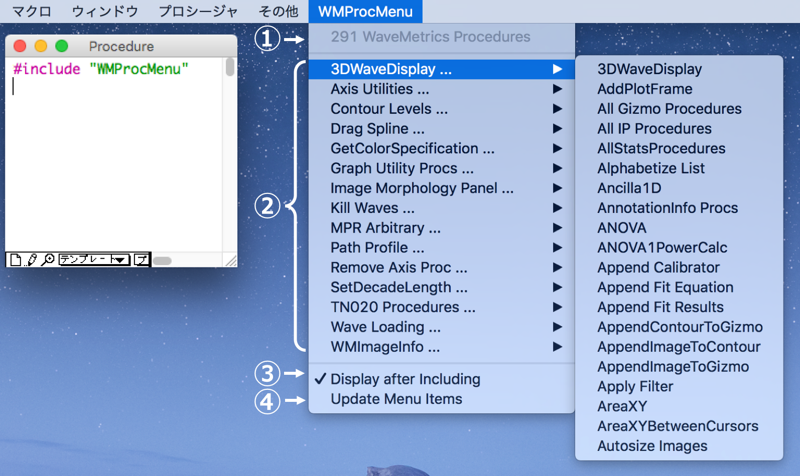

# Igor-WMProcMenu
Access WaveMetrics procedures from the menu bar

① Number of WaveMetrics procedures

② Insert `#include <Procedure Name>` at the main procedure window and compile it. Then open the loaded procedure window.

③ If one do not want to open a procedure window after loading it, remove the check by clicking

④ In usual, there is no need to click this. When one open the .pxp file in another PC, updating is required.
